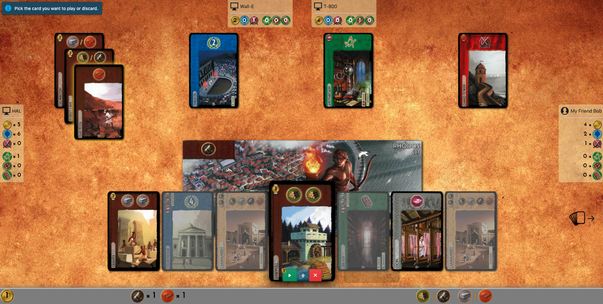
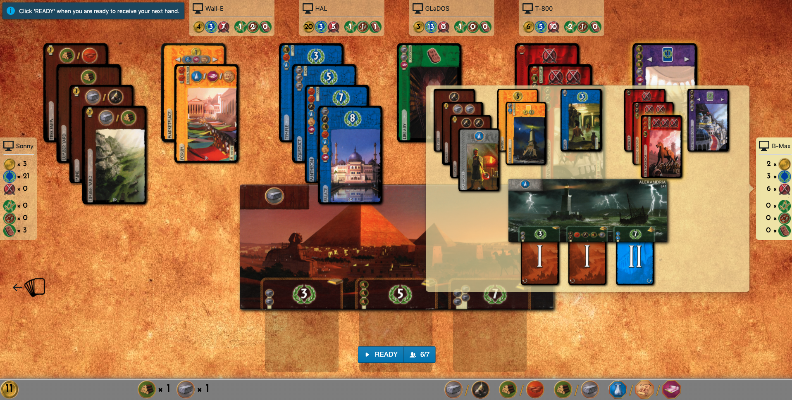

# Seven Wonders Online

[](https://github.com/joffrey-bion/seven-wonders/actions?query=workflow%3A%22ci-cd%22)
[](https://seven-wonders-online.herokuapp.com)
[](https://github.com/joffrey-bion/seven-wonders/blob/master/LICENSE)

A digital version of the [7 Wonders board game](https://en.wikipedia.org/wiki/7_Wonders_(board_game)).

> :warning: **DISCLAIMER:** We do not own the rights on the 7 Wonders game concept and rules, 
> nor on the assets used here. This is a pet project, not intended to be sold.

## Try it!

A staging version of the app is running [on heroku](https://seven-wonders-online.herokuapp.com/).
Heroku's free plan shuts down servers when not used for 30 minutes, so please allow for a bit of delay (~30s) if you're
 trying it on a cold start.

:construction: It is still under development, so the staging server is unstable as the CI/CD pipeline deploys the
 new app on it after every successful build of the master branch.
It is therefore possible that you experience a server restart if I just pushed some new changes.

#### Locally

You can also run the server on your own machine by running:

```
docker run -p 80:80 hildan/seven-wonders-server
```

And then go to `http://localhost` in your browser to play (add some bots if you're alone).

## Technicalities

This project is written 100% in Kotlin. You can find the history of the technical decisions in the
[decisions history](doc/decisions_history.md) document.

This project uses websockets and STOMP for the communication between frontend and backend.
For this, it uses the [krossbow](https://github.com/joffrey-bion/krossbow) multiplatform library.

## How does it look?

The game contains all features of the actual board game:

- Play cards, discard, or upgrade your wonder
- Buy resources from your neighbours
- Special bonuses: pick from discarded cards, play your 2 last cards, copy neighbour guild etc.

Online-only features:

- Add bots to play with you, even if you're less than the minimum 3 players
- The game greys out the cards you can't afford and the actions you can't perform
- You can see a preview of the cost of each action (play or upgrade)
- Save time to compute the score!

Some screenshots:

| Basic board | Hover to see your hand|
| --- | --- |
|  |  |

Preview your opponents' boards:

| In front | Left neighbour | Right neighbour |
| --- | --- | --- |
|  |  |  |
